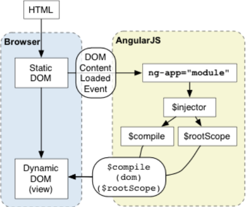
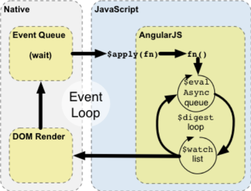
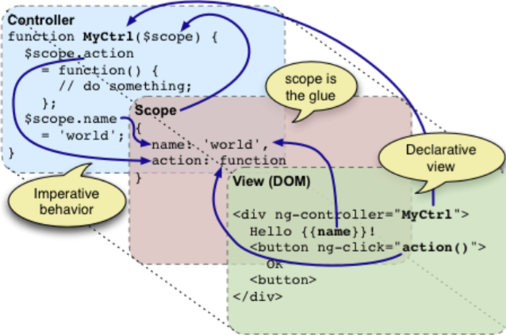
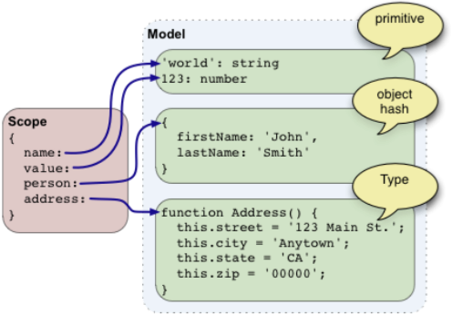
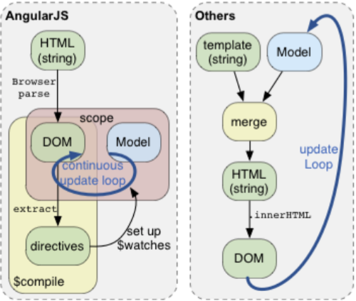
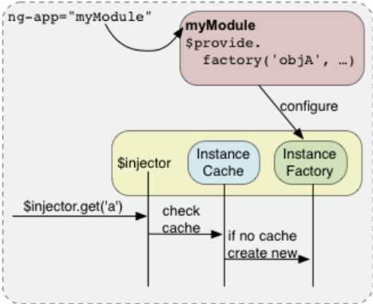

[Back to Main]
[Back to Main]: <https://github.com/Severenit/ngLoftSchool/>
<hr/>
# Обзор концепций

Этот раздел дает описание основных компонентов angular, а также позволяет понять как они взаимодействуют в процессе работы. Это компоненты:

- Запуск (startup) – который является дорогой в мир.
- Время выполнения (runtime) – обзор angular во время выполнения.
- Область видимости (scope) – слой между представлением и контроллером.
- Контроллер – поведение приложения.
- Модель – данные вашего приложения.
- Представление – это то, что видит пользователь.
- Директивы – расширения языка HTML.
- Фильтры – форматеры данных и локальные настройки приложения.
- Инжектор – собирает ваше приложение в целое.
- Модуль – является конфигуратором для инжектора.
- $ - angular пространство имен.

## Запуск


Итак, мы сдвинулись с мертвой точки. Как это произошло расскажем дальше, а также смотрите схему.

1. Браузер загружает HTML и анализирует его DOM.
2. Браузер грузит файл angular.js с движком angular.
3. Angular ожидает события DOMContentLoaded.
4. Angular ищет директиву ng-app, которая задает границы приложения.
5. Модуль, указанный в ng-app (если есть) используется для настройки инжектора.
6. Инжектор используется для создания сервиса $compile, а также $rootScope.
7. Сервис $compile используется для компиляции дерева DOM и связывания его с $rootScope.
8. Директива ng-init присваивает свойствам в $scope заданные значения.
9. {{name}} используется для вставки в данное место значение свойства name из $scope или $rootScope.

```html
  <!doctype html>
  <html ng-app>
    <body>
      <input type="text" ng-model="name">
      <p>Hello {{name}}!</p>
      
      <script src="angular.js"></script>
    </body>
  </html>
```
## Время выполнения


Схема и пример ниже описывают, как angular взаимодействует с циклом событий браузера.

- Браузер возбуждает определенное событие в ответ на действия пользователя, истечения времени или поступление данных по сети.
- По возникновению события запускается функция обратного вызова, в которой можно изменить DOM.
- После выполнения функции обратного вызова браузер выходит из контекста javascript и отображает изменения DOM на экране.

Angular изменяет нормальное течение javascript, представляя собственный цикл обработки событий. Это разбивает javascript на классический и angular контекст выполнения. Только операции, выполняемые в контексте выполнения angular, получают доступ к его привязкам данных, обработке исключений, изменениям свойств и т.д. Можно использовать функцию $apply() для перехода в контекст выполнения angular из javascript. Имейте ввиду, что в большинстве мест (контроллеры, сервисы) функция $apply() уже была вызвана за вас, для ваших директив, которые обрабатывают события. Явный вызов $apply() применяется при реализации пользовательских функций обратного вызова для событий или при работе со сторонними библиотечными функциями обратного вызова для событий браузера.

Еще один пример двунаправленного связыванния данных, и объяснение привязки данных на примере приложения “hello world”, которое изменяет вывод в ответ на ввод данных пользователем.
Давайте рассмотрим такой пример:

```html
  <!doctype html>
  <html ng-app>
    <body>
      <p ng-init=" name='World' ">Hello {{name}}!</p>
      
      <script src="angular.js"></script>
    </body>
  </html>
```
- Во время фазы компиляции:
    - Ng-model и директива input устанавливают обработчик события keydown для элемента input.
    - {{name}} отображает установленное значение name, а $watch уведомляет о любом изменении name.
- Во время этапа выполнения:
    - Нажатие пользователем на клавишу ‘x’ в элементе input приводит к генерации браузером события keydown.
    - Директива input отражает изменения в элементе input и вызывает $apply(name=’x’) для обновления модели данных внутри контекста Angular.
    - Angular изменяет свойство модели name на ‘x’.
    - Стартует цикл $digest.
    - $watch список отслеживает изменения свойства name и уведомляет об этом привязки, которые в свою очередь обновляют DOM.
    - Приложение выходит из контекста Angular, затем завершается обработка события keydown, и приложение покидает контекст javascript.
    - Браузер повторно отображает представление с новыми данными.

## Область видимости (scope)
Scope отвечает за обнаружение изменений в модели и обеспечивает контекст выполнения выражений. Scope вкладываются друг друга в иерархическую структуру и следят за всеми изменениями в DOM. (Смотрите документацию конкретной директивы, чтобы узнать какие из них создают собственную scope).

## Контроллер


Контролер связывает данные с представлением. Его задача заключается в построении модели и опубликовании ее в представлении расширяемом методами обратного вызова. Представление является проекцией scope на шаблон. Scope является слоем, который отображает модель на представление и направляет события в контроллер. Разделение контроллера и представления важно по следующим причинам:

- Контроллер пишется на javascript, и это обязательно. Он хорошо подходит для определения поведения приложения. Контроллер не должен содержать ни какой информации об отображении (DOM ссылки или HTML фрагменты).
- Представление написано на HTML, который является декларативным языком. Декларативный стиль хорошо подходит для определения представления. Представление не должно содержать ни какого поведения.
- Так как контроллер ничего не знает о представлении, может быть множество представлений на один и тот же контроллер. Это позволяет разрабатывать разные представления для отображения (re-skinning), для различных устройств (например мобильная версия и десктопная), а также позволяет легко их тестировать.

## Модель


Модель – это данные, которые объединяются с шаблоном чтобы отобразить представление. Чтобы отобразить модель на представление, нужно иметь на нее ссылку в scope. В отличии от других фрамеворков Angular не ограничивает модель ни чем и не предъявляет к ней ни каких требований. Не предлагается ни каких классов для реализации наследования, нет специальных методов для получения доступа к элементам модели. Модель может состоять из примитивных свойств, быть хэшем или полным классом. Обобщая сказанное – модель является простым объектом javascript.

## Представление


Представление, это то, что пользователь видит на экране компьютера. Представление начинается с шаблона, который сливается с моделью данных и в конце, отображается на экране браузером. Angular проповедует другой подход по реализаций представлений, не такой как многие другие фраймеворки:

- Другие фраймеворки – шаблоном является строка, с некоторым синтаксисом. Которая в процессе сливается с данными и на выходе получается строка с кодом HTML, которая и вставляется в код с помощью innerHTML. При изменении модели весь процесс повторяется заново. Ключевым здесь является то, что манипуляции с DOM проходят через строки.
- Angular – ключевое отличие в том, что система представлений работает непосредственно с DOM, а не со строками. Шаблоны по прежнему пишутся как строки, но это строки с валидным HTML, которые анализируются браузером, и на базе которых может быть построено дерево DOM, с которым и работает Angular через систему компиляции ($compile). Компилятор ищет в DOM директивы, создающие привязки к данным через объект $watch. В результате мы получаем постоянное обновление представления, для показа которого не требуется заново проводить слияние шаблона и модели.

## Директивы
Директивы – это поведение или трансформации DOM, которые вызываются когда в коде HTML присутствуют определенные элементы, атрибуты элементов или установлен определенный класс. 

Директивы – это способ добавить новое поведение при помощи новых элементов HTML. Во время компиляции DOM, директивы находятся в коде HTML и затем исполняются. Это позволяет с помощью директив реализовывать новое поведения или преобразовывать DOM.

Angular уже включает в себя множество директив, которые будут полезны при создании любого приложения, но легко также добавить и собственные директивы, в результате чего HTML может быть превращен в декларативный язык предметной области (DSL).
 
## Фильтры
Фильтры предназначены для трансформаций данных. Обычно они используются для форматирования данных в зависимости от текущих локальных настроек пользователя (например языка). Они следуют стиля UNIX фильтров и имеют примерно такой же синтаксис.

## Модули и инжектор


Инжектор – это локальный сервис, который существует в одном экземпляре для каждого приложения Angular. Инжектор позволяет проводить поиск экземпляра объекта по его имени. Он сохраняет в внутреннем кэше все вызовы объектов, чтобы обеспечить быстрый вызов объекта и эмитировать поведение одного экземпляра каждого объекта. Если объекта в кэше нет, тогда инжектор вызывает фабричный метод, который создает требуемый объект.

Модуль представляет собой конфигурацию для инжектора, известную как провайдер.

Но настоящая магия инжектора в том, что можно вызвать методы у созданных экземпляров. Эта тонкая особенность позволяет запрашивать методы и типы через зависимости, а не ища их.

## Пространство имен Angular
Для предотвращения конфликта имен в Angular используется префикс $. Пожалуйста, не используйте его в своих приложениях, чтобы случайно не создать конфликт имен.

## Интерполяция строк
Во время компиляции компилятор находит текст и атрибуты использую службу $interpolate и определяет, есть ли в найденном внедренные выражения. Найденные выражения регистрируются с помощью сервиса $watch и будут обновляться в результате цикла $digest. Пример интерполяции вы можете увидеть в следующей строке кода.

```html
  <a href="img/{{username}}.jpg">Hello {{username}}!</a>
```
